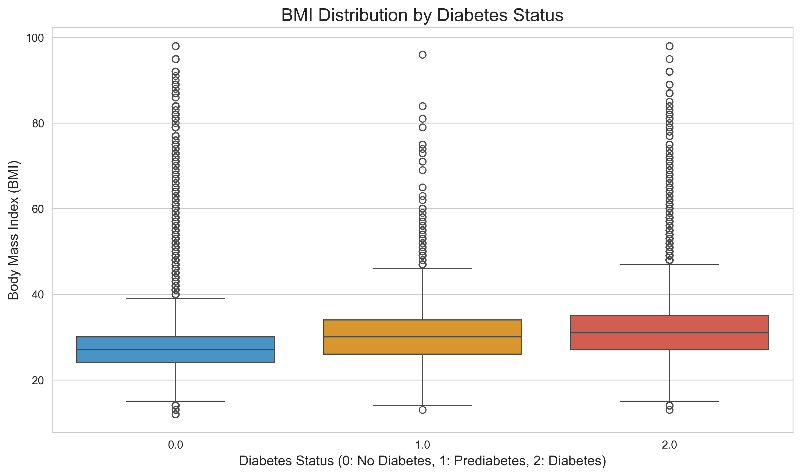
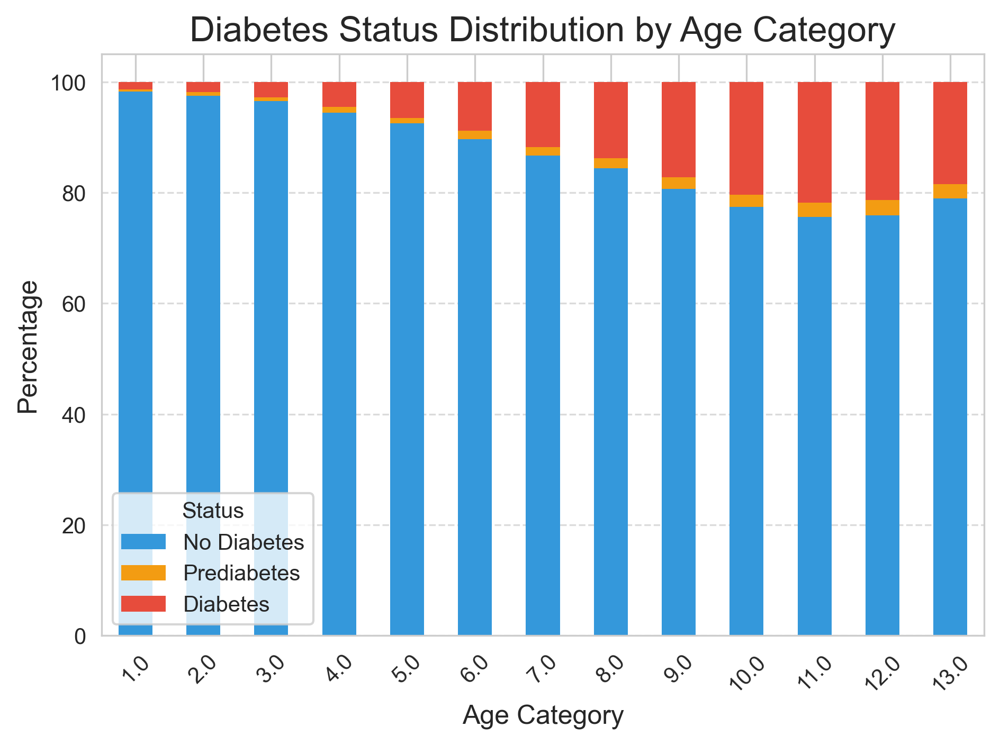
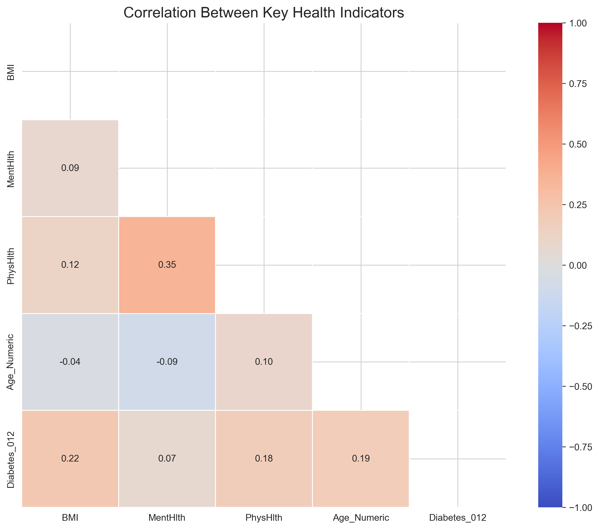
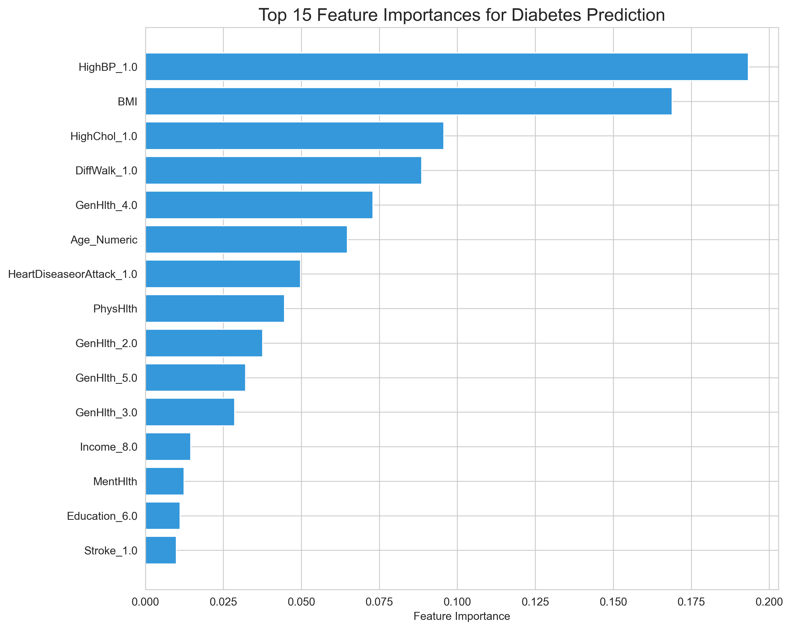

# Diabetes Risk Prediction System

A machine learning system that predicts diabetes risk with 85% accuracy using patient health indicators.

## Project Overview

- **Early Detection**: Identifies patients at risk of diabetes before symptom onset
- **Risk Factor Analysis**: Determines key health factors contributing to diabetes risk
- **Statistical Validation**: Applies robust statistical testing to verify risk factors
- **Comparative Analysis**: Evaluates multiple machine learning approaches for optimal prediction

## Key Visualizations

<table>
  <tr>
    <td></td>
    <td></td>
  </tr>
  <tr>
    <td></td>
    <td></td>
  </tr>
</table>

## Technical Implementation

- **Models**: Random Forest, SVM, and KNN classifiers with stratified cross-validation
- **Data Processing**: Comprehensive pipeline handling imbalanced classes and feature engineering
- **Evaluation**: Multiple performance metrics including sensitivity (84%) and specificity (87%)
- **Interpretability**: Feature importance analysis for understanding prediction factors

## Tech Stack

- Python
- scikit-learn
- pandas
- NumPy
- Matplotlib
- Seaborn

## Results

| Model | Accuracy | Precision | Recall | F1 Score | ROC AUC |
|-------|----------|-----------|--------|----------|---------|
| Random Forest | 85% | 86% | 84% | 85% | 0.92 |
| SVM | 81% | 82% | 80% | 81% | 0.89 |
| KNN | 79% | 80% | 78% | 79% | 0.86 |

